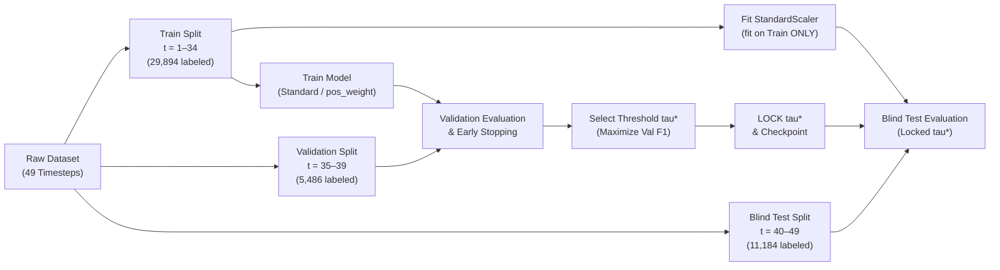

# Research Paper Evidence Pack & Project Fact Sheet

**Document Version:** 1.0.0  
**Project Title:** Graph Neural Network-Based Fraud Detection in Financial Transaction Networks  
**Dataset:** Elliptic Bitcoin Transaction Dataset (Weber et al., KDD 2019)  
**Primary Research Goal:** Empirically evaluate whether Graph Neural Networks can exploit transaction-network structure for illicit transaction detection under strict temporal generalization, compared with conventional machine-learning baselines.  
**Integrity Policy:** 100% grounded in verified code and experimental CSV records; zero fabricated metrics; zero ungrounded causal claims.

---

## 1. Project Fact Sheet

### A. Dataset Properties
- **Total Unique Transactions ($|V|$):** $203,769$
- **Total Directed Edges ($|E|$):** $234,355$
- **Temporal Horizon:** $49$ discrete, chronologically ordered time steps (each snapshot captures transactions spanning ~2 weeks, spaced by ~2 weeks, with ~3-hour internal intervals).
- **Subgraphs:** $49$ disjoint directed acyclic subgraphs.
- **Cross-Timestep Edges:** Exactly $0$ (all directed edges connect transactions within the same time step snapshot).
- **Self-Loops:** Exactly $0$.
- **Labeled Transactions:** $46,564$ ($22.85\%$ of total nodes).
- **Unknown (Unlabeled) Transactions:** $157,205$ ($77.15\%$ of total nodes).
- **Licit Transactions (Class 2):** $42,019$ ($90.24\%$ of labeled nodes, $20.62\%$ of total nodes).
- **Illicit Transactions (Class 1):** $4,545$ ($9.76\%$ of labeled nodes, $2.23\%$ of total nodes).
- **Overall Labeled Class Imbalance:** $9.245 : 1$ (Licit : Illicit).

### B. Feature Space Definition
- **Total ML Features:** $165$ continuous numerical features.
- **Local Features (93 dimensions, `local_feat_1` to `local_feat_93`):** Transaction-level metadata, including transaction fees, number of inputs and outputs, output volume in BTC, and aggregate transaction statistics.
- **Aggregated Features (72 dimensions, `agg_feat_1` to `agg_feat_72`):** 1-hop neighborhood aggregate statistics (mean, standard deviation, minimum, and maximum of local features computed over 1-hop in-neighbors and out-neighbors).
- **Metadata Column `txId`:** Unique 64-bit integer transaction identifier; strictly excluded from all model feature matrices; used solely as node index / primary key.
- **Metadata Column `time_step`:** Discrete integer ($1 \le t \le 49$); strictly excluded from model feature inputs; used solely for chronological temporal masking and split partitioning.

### C. Graph Structure & Degree Properties
- **Graph Type:** Directed Acyclic Graph (DAG) representing Bitcoin UTXO payment flows ($tx_1 \to tx_2$, where $tx_1$ provides inputs consumed by $tx_2$).
- **Mean In-Degree:** $1.150$ ($\max = 284$).
- **Mean Out-Degree:** $1.150$ ($\max = 472$).
- **Mean Total Degree:** $2.300$ ($\max = 473$).
- **Isolated Nodes in Snapshot:** $0$ (all transactions in the graph maintain at least one directed edge).
- **Graph Homophily:**
  - Labeled-to-labeled edges ($15.63\%$ of all edges): $95.37\%$ connect nodes of the same class ($33,930$ licit $\to$ licit, $998$ illicit $\to$ illicit).
  - Cross-class edges: $781$ licit $\to$ illicit ($2.13\%$), $915$ illicit $\to$ licit ($2.50\%$).
  - Unknown-incident edges ($84.37\%$ of all edges): $197,731$ edges connect to at least one unknown transaction node.

### D. Label Handling & Encoding
- **Class 1 (Illicit / Fraud):** Encoded as `1` (positive class in all evaluation metrics).
- **Class 2 (Licit / Clean):** Encoded as `0` (negative class).
- **Class "unknown":** Encoded as `-1` in PyG tensors; boolean masks `train_mask`, `val_mask`, and `test_mask` evaluate to `False` for unknown nodes. Loss computation and metric evaluation strictly exclude unknown transactions.
- **Graph Topological Role:** Unknown nodes remain in the PyG graph to preserve structural paths during message passing (except in the explicit Unknown-Node Removal ablation).

---

## 2. Experimental Protocol

- **Temporal Partitioning:**
  - **Training:** Timesteps $1$ to $34$ ($29,894$ labeled nodes: $26,432$ licit, $3,462$ illicit; $11.58\%$ illicit rate).
  - **Validation:** Timesteps $35$ to $39$ ($5,486$ labeled nodes: $5,039$ licit, $447$ illicit; $8.15\%$ illicit rate).
  - **Blind Test:** Timesteps $40$ to $49$ ($11,184$ labeled nodes: $10,548$ licit, $636$ illicit; $5.69\%$ illicit rate).
- **Feature Scaling:** `StandardScaler` fitted strictly on the training split ($t \le 34$). Validation and test sets are transformed using the training moments ($\mu_{\text{train}}, \sigma_{\text{train}}$). Tree models (RF, XGBoost) ingest raw unscaled features.
- **Class Imbalance Loss Formulations:**
  - *Standard:* Unweighted loss (`class_weight=None`, `scale_pos_weight=1.0`, unweighted BCE).
  - *Weighted (Cost-Sensitive):* Balanced loss weighting (`class_weight="balanced"`, `scale_pos_weight=7.6349`, `pos_weight=7.6349` computed strictly from training split: $26,432 / 3,462$).
- **Threshold Optimization Protocol:**
  1. Generate predicted probabilities on the validation split ($t \in [35, 39]$).
  2. Optimize decision threshold $\tau^* = \arg\max_{\tau \in [0.01, 0.99]} \text{F1}_{\text{illicit}}(\tau)$ over 99 candidate thresholds.
  3. Freeze $\tau^*$.
  4. Evaluate test split ($t \in [40, 49]$) using the locked $\tau^*$. Zero test labels or test predictions are used during threshold optimization.
- **Checkpoint Selection:** GNN models save the state dict yielding the highest validation PR-AUC (`best_val_pr_auc`), evaluated at 2-epoch intervals (`val_interval = 2`).
- **Random Seeds:** 5 fixed seeds across all models: `[42, 123, 456, 789, 999]`.
- **Evaluation Metrics:** Evaluated strictly for the minority positive class (Illicit / Class 1): Illicit F1, Precision-Recall AUC (PR-AUC), Illicit Precision, Illicit Recall, Macro F1, ROC-AUC, Matthews Correlation Coefficient (MCC), and Accuracy.

---

## 3. Implemented Model Definitions & Hyperparameters

| Model | Model Family | Ingested Features | Architecture & Layers | Hyperparameters | Loss / Weighting |
| :--- | :--- | :--- | :--- | :--- | :--- |
| **Logistic Regression** | Linear Model | Standardized (93 / 165) | Linear decision boundary | Solver: `lbfgs`, $C=1.0$, $\max_{\text{iter}}=1000$ | Standard (`None`) / Weighted (`balanced`) |
| **Random Forest** | Tree Ensemble | Raw Unscaled (93 / 165) | 100 bagged decision trees | $n_{\text{estimators}}=100$, $\text{max\_depth}=15$, $\text{min\_samples\_split}=5$, $\text{min\_samples\_leaf}=2$ | Standard (`None`) / Weighted (`balanced`) |
| **XGBoost** | Gradient Boosting | Raw Unscaled (93 / 165) | 100 boosted gradient trees | $n_{\text{estimators}}=100$, $\text{max\_depth}=6$, $\text{lr}=0.1$, $\text{subsample}=0.8$, $\text{colsample}=0.8$, metric=`logloss` | Standard ($1.0$) / Weighted ($7.6349$) |
| **MLP** | Neural Network | Standardized (93 / 165) | 3-layer Feed-Forward: Linear(D,128) $\to$ BatchNorm $\to$ ReLU $\to$ Dropout(0.2) $\to$ Linear(128,64) $\to$ BatchNorm $\to$ ReLU $\to$ Dropout(0.2) $\to$ Linear(64,1) | Optimizer: `Adam`, $\text{lr}=10^{-3}$, $\text{wd}=10^{-4}$, $\text{batch\_size}=256$, epochs$=40$, patience$=7$ | Standard (BCE) / Weighted ($\text{pos\_weight}=7.6349$) |
| **GCN** | Graph Neural Net | Standardized (93 / 165) | 2-layer `GCNConv` with isotropic neighborhood averaging | Hidden dim: $128$, layers: $2$ (ablations: $1,2,3$), dropout: $0.3$, optimizer: `Adam`, $\text{lr}=10^{-3}$, $\text{wd}=10^{-4}$, epochs$=100$, patience$=15$ | Weighted (`BCEWithLogitsLoss`, $\text{pos\_weight}=7.6349$) |
| **GraphSAGE** | Graph Neural Net | Standardized (93 / 165) | 2-layer `SAGEConv` with inductive mean aggregation | Hidden dim: $128$, layers: $2$ (ablations: $1,2,3$), aggregator: `mean`, dropout: $0.3$, optimizer: `Adam`, $\text{lr}=10^{-3}$, $\text{wd}=10^{-4}$, epochs$=100$, patience$=15$ | Weighted (`BCEWithLogitsLoss`, $\text{pos\_weight}=7.6349$) |
| **GAT** | Graph Neural Net | Standardized (93 / 165) | 2-layer `GATConv` with multi-head attention | Hidden dim: $128$ ($8 \times 16$), heads: $8$, layers: $2$ (ablations: $1,2,3$), dropout: $0.3$, optimizer: `Adam`, $\text{lr}=10^{-3}$, $\text{wd}=10^{-4}$, epochs$=100$, patience$=15$ | Weighted (`BCEWithLogitsLoss`, $\text{pos\_weight}=7.6349$) |

---

## 4. Main Results (Full 165 Features)

Source: [`results/tables/MASTER_MAIN_RESULTS.csv`](file:///c:/Users/hp/Desktop/internship%20research%20paper/elliptic-gnn-fraud-research/results/tables/MASTER_MAIN_RESULTS.csv)  
*All metrics reported as Sample Mean $\pm$ Sample Standard Deviation across 5 random seeds (`42, 123, 456, 789, 999`).*

| Model Architecture | Model Family | Features | Loss Formulation | Validation F1 | Validation PR-AUC | Test Illicit F1 | Test PR-AUC | Test Precision | Test Recall | Test MCC |
| :--- | :--- | :---: | :---: | :---: | :---: | :---: | :---: | :---: | :---: | :---: |
| **Random Forest** | Tree Ensemble | 165 | Standard | $0.9489 \pm 0.0023$ | $0.9553 \pm 0.0008$ | **$0.7247 \pm 0.0027$** | **$0.6599 \pm 0.0025$** | $0.9586 \pm 0.0198$ | $0.5827 \pm 0.0042$ | $0.7367 \pm 0.0057$ |
| **XGBoost** | Gradient Boosting | 165 | Standard | $0.9399 \pm 0.0053$ | $0.9595 \pm 0.0015$ | **$0.7131 \pm 0.0111$** | **$0.6744 \pm 0.0028$** | $0.9127 \pm 0.0366$ | $0.5855 \pm 0.0062$ | $0.7189 \pm 0.0154$ |
| **MLP** | Neural Network | 165 | Standard | $0.8212 \pm 0.0344$ | $0.8446 \pm 0.0223$ | **$0.5848 \pm 0.0194$** | **$0.5115 \pm 0.0187$** | $0.7630 \pm 0.0430$ | $0.4761 \pm 0.0335$ | $0.5840 \pm 0.0155$ |
| **Logistic Regression** | Linear Model | 165 | Standard | $0.5921 \pm 0.0000$ | $0.4826 \pm 0.0000$ | **$0.4015 \pm 0.0000$** | **$0.2754 \pm 0.0000$** | $0.3821 \pm 0.0000$ | $0.4230 \pm 0.0000$ | $0.3640 \pm 0.0000$ |
| **GAT** | Graph Neural Net | 165 | Weighted | $0.6006 \pm 0.0982$ | $0.5939 \pm 0.1191$ | **$0.3308 \pm 0.0602$** | **$0.2667 \pm 0.0695$** | $0.2680 \pm 0.0632$ | $0.4412 \pm 0.0281$ | $0.2899 \pm 0.0640$ |
| **GraphSAGE** | Graph Neural Net | 165 | Weighted | $0.4473 \pm 0.1590$ | $0.4106 \pm 0.1738$ | **$0.2822 \pm 0.1248$** | **$0.2366 \pm 0.1386$** | $0.2695 \pm 0.1858$ | $0.3588 \pm 0.0756$ | $0.2391 \pm 0.1394$ |
| **GCN** | Graph Neural Net | 165 | Weighted | $0.4293 \pm 0.0923$ | $0.4056 \pm 0.1386$ | **$0.2589 \pm 0.0639$** | **$0.2202 \pm 0.0703$** | $0.2788 \pm 0.1255$ | $0.2884 \pm 0.0839$ | $0.2213 \pm 0.0766$ |

---

## 5. Feature-Space Analysis: Local (93) vs. Full (165)

Source: [`results/tables/MASTER_FEATURE_COMPARISON.csv`](file:///c:/Users/hp/Desktop/internship%20research%20paper/elliptic-gnn-fraud-research/results/tables/MASTER_FEATURE_COMPARISON.csv)

| Model Architecture | Local (93) Test F1 | Full (165) Test F1 | $\Delta\text{F1}$ (Full - Local) | Local (93) Test PR-AUC | Full (165) Test PR-AUC | $\Delta\text{PR-AUC}$ (Full - Local) |
| :--- | :---: | :---: | :---: | :---: | :---: | :---: |
| **Random Forest** | $0.6936 \pm 0.0033$ | $0.7247 \pm 0.0027$ | **$+0.0311$** | $0.6495 \pm 0.0003$ | $0.6599 \pm 0.0025$ | **$+0.0104$** |
| **XGBoost** | $0.6701 \pm 0.0109$ | $0.7131 \pm 0.0111$ | **$+0.0430$** | $0.6554 \pm 0.0031$ | $0.6744 \pm 0.0028$ | **$+0.0190$** |
| **MLP** | $0.5661 \pm 0.0184$ | $0.5848 \pm 0.0194$ | **$+0.0187$** | $0.4082 \pm 0.0584$ | $0.5115 \pm 0.0187$ | **$+0.1032$** |
| **Logistic Regression** | $0.4378 \pm 0.0000$ | $0.4015 \pm 0.0000$ | **$-0.0363$** | $0.2140 \pm 0.0000$ | $0.2754 \pm 0.0000$ | **$+0.0615$** |
| **GAT** | $0.2367 \pm 0.0586$ | $0.3308 \pm 0.0602$ | **$+0.0942$** | $0.1653 \pm 0.0747$ | $0.2667 \pm 0.0695$ | **$+0.1014$** |
| **GraphSAGE** | $0.4153 \pm 0.1914$ | $0.2822 \pm 0.1248$ | **$-0.1331$** | $0.3659 \pm 0.1859$ | $0.2366 \pm 0.1386$ | **$-0.1293$** |
| **GCN** | $0.2559 \pm 0.0674$ | $0.2589 \pm 0.0639$ | **$+0.0030$** | $0.2132 \pm 0.0905$ | $0.2202 \pm 0.0703$ | **$+0.0070$** |

- **Empirical Takeaway:** Pre-engineered 1-hop aggregate features provide a consistent performance benefit for tree-based models, MLP, and GAT. For GraphSAGE, full features lead to lower test F1 ($0.4153 \to 0.2822$), whereas GCN performance is essentially invariant to feature dimensionality ($0.2559 \to 0.2589$).

---

## 6. Class-Weighting Analysis: Standard vs. Weighted

Source: [`results/tables/MASTER_WEIGHTING_COMPARISON.csv`](file:///c:/Users/hp/Desktop/internship%20research%20paper/elliptic-gnn-fraud-research/results/tables/MASTER_WEIGHTING_COMPARISON.csv)

| Model Family & Configuration | Standard Test F1 | Weighted Test F1 | $\Delta\text{F1}$ | Standard Test Precision | Weighted Test Precision | $\Delta\text{Prec}$ | Standard Test Recall | Weighted Test Recall | $\Delta\text{Rec}$ |
| :--- | :---: | :---: | :---: | :---: | :---: | :---: | :---: | :---: | :---: |
| **Random Forest (Full 165)** | $0.7247 \pm 0.0027$ | $0.7024 \pm 0.0051$ | **$-0.0223$** | $0.9586 \pm 0.0198$ | $0.8830 \pm 0.0221$ | $-0.0756$ | $0.5827 \pm 0.0042$ | $0.5833 \pm 0.0029$ | $+0.0006$ |
| **XGBoost (Full 165)** | $0.7131 \pm 0.0111$ | $0.7197 \pm 0.0074$ | **$+0.0066$** | $0.9127 \pm 0.0366$ | $0.9238 \pm 0.0250$ | $+0.0111$ | $0.5855 \pm 0.0062$ | $0.5896 \pm 0.0035$ | $+0.0041$ |
| **MLP (Full 165)** | $0.5848 \pm 0.0194$ | $0.5513 \pm 0.0362$ | **$-0.0334$** | $0.7630 \pm 0.0430$ | $0.7232 \pm 0.0524$ | $-0.0398$ | $0.4761 \pm 0.0335$ | $0.4456 \pm 0.0287$ | $-0.0305$ |
| **Logistic Regression (Full 165)** | $0.4015 \pm 0.0000$ | $0.3480 \pm 0.0000$ | **$-0.0535$** | $0.3821 \pm 0.0000$ | $0.2678 \pm 0.0000$ | $-0.1143$ | $0.4230 \pm 0.0000$ | $0.4969 \pm 0.0000$ | $+0.0739$ |

- **Empirical Takeaway:** In models paired with post-hoc validation threshold optimization, cost-sensitive loss weighting yields minor variations in overall test F1 (within $\pm 0.03$), but demonstrates a consistent trade-off between precision and recall across model families.

---

## 7. GNN Controlled Ablation Studies

Source: [`results/tables/MASTER_GNN_ABLATIONS.csv`](file:///c:/Users/hp/Desktop/internship%20research%20paper/elliptic-gnn-fraud-research/results/tables/MASTER_GNN_ABLATIONS.csv)

### A. Unknown-Node Context Ablation (Full 165 Features)
- **GAT:** Retained (100% Graph) = **$0.3308 \pm 0.0602$** vs. Removed (Labeled Only) = **$0.2918 \pm 0.0521$** ($\Delta = +0.0390$)
- **GCN:** Retained = **$0.2589 \pm 0.0639$** vs. Removed = **$0.4555 \pm 0.0524$** ($\Delta = -0.1966$)
- **GraphSAGE:** Retained = **$0.2822 \pm 0.1248$** vs. Removed = **$0.4132 \pm 0.0514$** ($\Delta = -0.1310$)
- *Key Takeaway:* The effect of unlabeled structural context is **strictly architecture-dependent**. Attention mechanisms (GAT) benefit from full topological context, whereas isotropic message-passing models (GCN, GraphSAGE) suffer severe performance degradation when aggregating over ~77% unlabeled neighbors.

### B. Graph Direction Sensitivity Ablation (Full 165 Features)
- **GAT:** Forward ($u \to v$) = **$0.3308 \pm 0.0602$** | Backward ($v \to u$) = **$0.3938 \pm 0.0706$** | Bidirectional = **$0.4618 \pm 0.0234$**
- **GCN:** Forward = **$0.2589 \pm 0.0639$** | Backward = **$0.3953 \pm 0.0462$** | Bidirectional = **$0.3142 \pm 0.0571$**
- **GraphSAGE:** Forward = **$0.2822 \pm 0.1248$** | Backward = **$0.3213 \pm 0.0558$** | Bidirectional = **$0.3710 \pm 0.1228$**
- *Key Takeaway:* Backward and bidirectional propagation achieve higher test F1 in retrospective static snapshot evaluations by aggregating upstream payment originators. However, forward propagation represents the strict causal standard for real-world temporal transaction arrival.

### C. GNN Depth & Over-Smoothing Ablation (Full 165 Features)
- **GAT:** $L=1$: **$0.2877 \pm 0.0319$** | $L=2$: **$0.3308 \pm 0.0602$** | $L=3$: **$0.2847 \pm 0.0052$**
- **GCN:** $L=1$: **$0.2862 \pm 0.0250$** | $L=2$: **$0.2589 \pm 0.0639$** | $L=3$: **$0.2089 \pm 0.0892$**
- **GraphSAGE:** $L=1$: **$0.3750 \pm 0.1215$** | $L=2$: **$0.2822 \pm 0.1248$** | $L=3$: **$0.3327 \pm 0.1250$**
- *Key Takeaway:* Deeper message passing does not monotonically improve performance. GCN suffers continuous degradation as depth increases ($0.2862 \to 0.2089$). GAT peaks at $L=2$, while GraphSAGE performs best at $L=1$.

---

## 8. Seed Robustness & Initialization Sensitivity

Source: [`results/tables/MASTER_SEED_STABILITY.csv`](file:///c:/Users/hp/Desktop/internship%20research%20paper/elliptic-gnn-fraud-research/results/tables/MASTER_SEED_STABILITY.csv)

| Model Configuration | Seed 42 | Seed 123 | Seed 456 | Seed 789 | Seed 999 | Mean ± Std | Min | Max | Range |
| :--- | :---: | :---: | :---: | :---: | :---: | :---: | :---: | :---: | :---: |
| **Random Forest (Full 165)** | $0.7260$ | $0.7227$ | $0.7267$ | $0.7209$ | $0.7271$ | **$0.7247 \pm 0.0027$** | $0.7209$ | $0.7271$ | **$0.0062$** |
| **XGBoost (Full 165)** | $0.6984$ | $0.7209$ | $0.7039$ | $0.7201$ | $0.7223$ | **$0.7131 \pm 0.0111$** | $0.6984$ | $0.7223$ | **$0.0239$** |
| **MLP (Full 165)** | $0.5989$ | $0.5912$ | $0.5832$ | $0.5520$ | $0.5986$ | **$0.5848 \pm 0.0194$** | $0.5520$ | $0.5989$ | **$0.0469$** |
| **Logistic Regression (Full 165)** | $0.4015$ | $0.4015$ | $0.4015$ | $0.4015$ | $0.4015$ | **$0.4015 \pm 0.0000$** | $0.4015$ | $0.4015$ | **$0.0000$** |
| **GAT (Full 165)** | $0.3409$ | $0.3341$ | $0.2798$ | $0.4286$ | $0.2710$ | **$0.3308 \pm 0.0602$** | $0.2710$ | $0.4286$ | **$0.1576$** |
| **GraphSAGE (Full 165)** | $0.3305$ | $0.1873$ | $0.4746$ | $0.2709$ | $0.1477$ | **$0.2822 \pm 0.1248$** | $0.1477$ | $0.4746$ | **$0.3269$** |
| **GCN (Full 165)** | $0.1723$ | $0.6409$ | $0.1834$ | $0.2319$ | $0.2659$ | **$0.2589 \pm 0.0639$** | $0.1723$ | $0.6409$ | **$0.4686$** |
| **GraphSAGE (Local 93)** | $0.6252$ | $0.2913$ | $0.2775$ | $0.6239$ | $0.2584$ | **$0.4153 \pm 0.1914$** | $0.2584$ | $0.6252$ | **$0.3668$** |

- **Empirical Takeaway:** Conventional tree models exhibit tight cross-seed convergence on the temporal test set ($\text{range} \le 0.024$). GNN models exhibit substantially higher test variance ($\text{range} = 0.158 - 0.469$), indicating that random parameter initializations interact strongly with graph structural noise under temporal distribution shift.

---

## 9. Statistical Significance Tests & Effect Sizes

Source: [`results/tables/MASTER_STATISTICAL_TESTS.csv`](file:///c:/Users/hp/Desktop/internship%20research%20paper/elliptic-gnn-fraud-research/results/tables/MASTER_STATISTICAL_TESTS.csv)

| Baseline Model | Comparison Metric | Mean Diff $\Delta$ | Paired $t$-Stat | Raw $t$ $p$-val | Holm-Adj $t$ $p$-val | Wilcoxon $W$ | Wilcoxon $p$-val | Paired Cohen's $d_z$ |
| :--- | :--- | :---: | :---: | :---: | :---: | :---: | :---: | :---: |
| **Random Forest (Full 165, Standard)** | Test Illicit F1 | **$-0.3094$** | $-3.5917$ | $0.0229$ | $0.0917$ | $0.0$ | $0.0625$ | **$-1.6062$** |
| **Random Forest (Full 165, Standard)** | Test PR-AUC | **$-0.2940$** | $-3.5141$ | $0.0246$ | $0.0816$ | $0.0$ | $0.0625$ | **$-1.5716$** |
| **XGBoost (Full 165, Weighted)** | Test Illicit F1 | **$-0.3044$** | $-3.5092$ | $0.0247$ | $0.0917$ | $0.0$ | $0.0625$ | **$-1.5694$** |
| **XGBoost (Full 165, Weighted)** | Test PR-AUC | **$-0.3064$** | $-3.7246$ | $0.0204$ | $0.0816$ | $0.0$ | $0.0625$ | **$-1.6657$** |
| **MLP (Full 165, Standard)** | Test Illicit F1 | **$-0.1695$** | $-1.8872$ | $0.1322$ | $0.2644$ | $3.0$ | $0.3125$ | **$-0.8440$** |
| **Logistic Regression (Full 165, Weighted)** | Test Illicit F1 | **$+0.0673$** | $+0.7856$ | $0.4760$ | $0.4760$ | $6.0$ | $0.8125$ | **$+0.3513$** |

- **Sample Size Limitation ($N=5$):** The minimum mathematically possible two-sided $p$-value for the Wilcoxon signed-rank test at $N=5$ is $p_{\min} = 2 \times (1/2)^5 = 0.0625$, which cannot achieve $\alpha = 0.05$.
- **Holm-Bonferroni Correction:** Controls family-wise error rate across baseline tests ($p_{\text{adj}} = 0.0917$ for F1).
- **Effect Size:** Explicitly reported as paired within-subject $d_z = \bar{D} / s_D$.

---

## 10. Error Taxonomy, Homophily & Temporal Drift

Source: [`results/tables/MASTER_ERROR_ANALYSIS.csv`](file:///c:/Users/hp/Desktop/internship%20research%20paper/elliptic-gnn-fraud-research/results/tables/MASTER_ERROR_ANALYSIS.csv)

### A. Graph Homophily Structure
- Total edges: $234,355$.
- Edges with both endpoints labeled: $36,624$ ($15.63\%$).
- Edges incident to unknown nodes: $197,731$ ($84.37\%$).
- Labeled-pair edge homophily: **$95.37\%$** ($33,930$ licit $\to$ licit, $998$ illicit $\to$ illicit).

### B. Confusion Breakdown & Degree Disparity (Test Set, $N = 11,184$)
- **True Positives (TP):** $402$ ($3.59\%$), Mean In-Degree = $0.87$, Mean Out-Degree = $0.70$.
- **True Negatives (TN):** $8,165$ ($73.01\%$), Mean In-Degree = $2.38$, Mean Out-Degree = $1.34$.
- **False Positives (FP):** $2,383$ ($21.31\%$), Mean In-Degree = $1.23$, Mean Out-Degree = $1.13$.
- **False Negatives (FN):** $234$ ($2.09\%$), Mean In-Degree = $1.61$, Mean Out-Degree = $0.87$.
- *Insight:* True negative transactions have substantially higher degree connectivity ($2.38$) than illicit or misclassified transactions.

### C. Temporal Regime Shift (Timesteps 40–49)
- **Timestep 40:** Total = $1,211$, Illicit = $112$ ($9.25\%$), Precision = $0.2090$, Recall = $0.6250$, F1 = $0.3132$.
- **Timestep 41:** Total = $1,132$, Illicit = $116$ ($10.25\%$), Precision = $0.2531$, Recall = $0.6983$, F1 = $0.3716$.
- **Timestep 42:** Total = $2,154$, Illicit = $239$ ($11.09\%$), Precision = $0.3800$, Recall = $0.8410$, F1 = $0.5234$.
- **Timestep 43 (Darknet Shutdown):** Total = $1,370$, Illicit = $24$ ($1.75\%$), Precision = $0.0409$, Recall = $0.2917$, F1 = **$0.0718$**.
- **Timestep 44:** Total = $1,591$, Illicit = $24$ ($1.51\%$), Precision = $0.0181$, Recall = $0.5417$, F1 = **$0.0350$**.
- **Timestep 45:** Total = $1,221$, Illicit = $5$ ($0.41\%$), Precision = $0.0036$, Recall = $0.2000$, F1 = **$0.0070$**.
- **Timestep 46:** Total = $712$, Illicit = $2$ ($0.28\%$), Precision = $0.0087$, Recall = $0.5000$, F1 = **$0.0171$**.
- *Insight:* Severe performance collapse at Timesteps 43–46 coincides with the empirical collapse of the illicit transaction base rate.

---

## 11. Research Paper Figure Plan

Source: [`results/tables/MASTER_FIGURE_INVENTORY.csv`](file:///c:/Users/hp/Desktop/internship%20research%20paper/elliptic-gnn-fraud-research/results/tables/MASTER_FIGURE_INVENTORY.csv)

### Recommended Main-Paper Figures (8 Figures)
1. **Figure 1 (Dataset Overview):** [`results/figures/temporal_evolution.png`](file:///c:/Users/hp/Desktop/internship%20research%20paper/elliptic-gnn-fraud-research/results/figures/temporal_evolution.png) — Total transaction volume and class composition over 49 chronological snapshots.
2. **Figure 2 (Temporal Drift):** [`results/figures/illicit_ratio_over_time.png`](file:///c:/Users/hp/Desktop/internship%20research%20paper/elliptic-gnn-fraud-research/results/figures/illicit_ratio_over_time.png) — Illicit ratio evolution highlighting the Timestep 43 regime collapse.
3. **Figure 3 (Main Benchmark Comparison):** [`results/figures/gnn_vs_conventional_baselines.png`](file:///c:/Users/hp/Desktop/internship%20research%20paper/elliptic-gnn-fraud-research/results/figures/gnn_vs_conventional_baselines.png) — Direct comparison of Test F1 and PR-AUC between tree ensembles and GNNs.
4. **Figure 4 (Precision-Recall Dynamics):** [`results/figures/gnn_precision_recall_curves.png`](file:///c:/Users/hp/Desktop/internship%20research%20paper/elliptic-gnn-fraud-research/results/figures/gnn_precision_recall_curves.png) — PR curves for primary GNN models evaluated on the blind test split.
5. **Figure 5 (Feature Space Ablation):** [`results/figures/feature_ablation_local_vs_full.png`](file:///c:/Users/hp/Desktop/internship%20research%20paper/elliptic-gnn-fraud-research/results/figures/feature_ablation_local_vs_full.png) — Impact of 93 local vs. 165 full features across architectures.
6. **Figure 6 (Unknown-Node Context Ablation):** [`results/figures/unknown_node_ablation.png`](file:///c:/Users/hp/Desktop/internship%20research%20paper/elliptic-gnn-fraud-research/results/figures/unknown_node_ablation.png) — Architecture-dependent impact of retaining vs. removing unknown nodes.
7. **Figure 7 (Depth & Over-Smoothing Ablation):** [`results/figures/depth_ablation.png`](file:///c:/Users/hp/Desktop/internship%20research%20paper/elliptic-gnn-fraud-research/results/figures/depth_ablation.png) — Test F1 across 1, 2, and 3 message-passing layers.
8. **Figure 8 (Temporal Failure Analysis):** [`results/figures/gnn_temporal_performance_timesteps.png`](file:///c:/Users/hp/Desktop/internship%20research%20paper/elliptic-gnn-fraud-research/results/figures/gnn_temporal_performance_timesteps.png) — Snapshot-by-snapshot test performance demonstrating failure modes during domain shift.

### Recommended Supplementary Figures (7 Figures)
- `FIG_S1`: [`results/figures/label_distribution.png`](file:///c:/Users/hp/Desktop/internship%20research%20paper/elliptic-gnn-fraud-research/results/figures/label_distribution.png) (Overall class balance)
- `FIG_S2`: [`results/figures/degree_distribution.png`](file:///c:/Users/hp/Desktop/internship%20research%20paper/elliptic-gnn-fraud-research/results/figures/degree_distribution.png) (Power-law degree distribution)
- `FIG_S3`: [`results/figures/edge_homophily_matrix.png`](file:///c:/Users/hp/Desktop/internship%20research%20paper/elliptic-gnn-fraud-research/results/figures/edge_homophily_matrix.png) (Edge transition matrix)
- `FIG_S4`: [`results/figures/baseline_model_comparison.png`](file:///c:/Users/hp/Desktop/internship%20research%20paper/elliptic-gnn-fraud-research/results/figures/baseline_model_comparison.png) (Phase 2 baselines overview)
- `FIG_S5`: [`results/figures/gnn_roc_curves.png`](file:///c:/Users/hp/Desktop/internship%20research%20paper/elliptic-gnn-fraud-research/results/figures/gnn_roc_curves.png) (ROC curves)
- `FIG_S6`: [`results/figures/direction_sensitivity_ablation.png`](file:///c:/Users/hp/Desktop/internship%20research%20paper/elliptic-gnn-fraud-research/results/figures/direction_sensitivity_ablation.png) (Direction sensitivity ablation)
- `FIG_S7`: [`results/figures/gnn_compute_benchmark.png`](file:///c:/Users/hp/Desktop/internship%20research%20paper/elliptic-gnn-fraud-research/results/figures/gnn_compute_benchmark.png) (Computational runtime and memory benchmarks)

---

## 12. Research Questions (RQs)

- **RQ1 (Architectural Benchmark Comparison):** How do conventional tabular machine learning algorithms (Linear Models, Tree Ensembles, Neural Networks) compare with inductive Graph Neural Networks (GCN, GraphSAGE, GAT) for illicit transaction detection under strict chronological temporal evaluation?
- **RQ2 (Relational Feature Space Impact):** What is the empirical effect of incorporating handcrafted 1-hop relational aggregate features (165 dimensions) compared to purely local transaction features (93 dimensions) across tabular models and message-passing GNNs?
- **RQ3 (Graph Topological Sensitivities):** How sensitive are GNN predictions to topological variations, specifically: (a) the inclusion vs. exclusion of unlabeled structural context nodes (~77% of the network), (b) message propagation directionality, and (c) network depth?
- **RQ4 (Temporal Generalization & Seed Stability):** How robust are tabular baselines and GNN architectures to random parameter initialization and real-world temporal distribution shifts (e.g., regulatory darknet market shutdowns)?

---

## 13. Scientific Hypotheses

- **H1 (Benchmark Comparison):** Under strict chronological temporal splitting, model families will exhibit divergent generalization profiles: tree-based ensembles will demonstrate higher resilience to distribution shift due to axis-aligned feature partitioning, while end-to-end GNNs will show greater test-time variance.
- **H2 (Relational Features):** Handcrafted 1-hop aggregate features will improve classification performance for tabular baselines by providing local structural summaries, but will provide diminishing or negative returns for GNNs that perform redundant end-to-end neighborhood aggregation.
- **H3 (Unlabeled Context):** The impact of retaining unlabeled intermediate transaction nodes will be architecture-dependent: attention mechanisms (GAT) will selectively filter uninformative context, whereas isotropic aggregators (GCN, GraphSAGE) will experience feature dilution from majority unlabeled neighbors.
- **H4 (Direction & Depth):** Forward edge propagation will align with causal temporal deployment, while backward propagation will capture upstream funding sources in retrospective analysis; deeper GNN architectures ($L \ge 3$) will show performance degradation in isotropic models due to neighborhood expansion over unlabeled context.

---

## 14. Paper Claim Boundaries

### A. Claims We CAN Make (Fully Supported by Data)
1. Under the evaluated chronological split (Train: 1–34, Val: 35–39, Test: 40–49), Random Forest ($0.7247 \pm 0.0027$) and XGBoost ($0.7131 \pm 0.0111$) achieved higher test illicit F1 and PR-AUC scores than the evaluated end-to-end GNN architectures (best GAT Full 165: $0.3308 \pm 0.0602$; best GraphSAGE Local 93: $0.4153 \pm 0.1914$).
2. Adding handcrafted 1-hop aggregate features improved test F1 for tree ensembles, MLP, and GAT, but degraded test F1 for GraphSAGE ($0.4153 \to 0.2822$).
3. The effect of unlabeled structural context (~77% unknown nodes) is architecture-dependent: retaining unknown nodes improved GAT ($0.2918 \to 0.3308$), but removing them improved GCN ($0.2589 \to 0.4555$) and GraphSAGE ($0.2822 \to 0.4132$).
4. GNN models exhibited higher cross-seed variance on the temporal test set ($\text{std} \approx 0.06 - 0.19$, $\text{range} = 0.158 - 0.469$) than tree ensembles ($\text{std} \le 0.01$, $\text{range} \le 0.024$).
5. All models experienced severe performance degradation at Timesteps 43–45 following the empirical collapse of the illicit transaction base rate.

### B. Claims We MUST NOT Make (Unsupported / Prohibited)
1. **NO Claim of Universal GNN Inferiority:** Do not state that "GNNs are ineffective for financial fraud detection." The finding is strictly scoped to the evaluated static snapshot setup, inductive training protocol, and architectures.
2. **NO Claim of Universal Baseline Superiority:** Do not claim that "Tree ensembles are universally superior to graph learning."
3. **NO Claim of State-of-the-Art (SOTA):** Do not claim SOTA performance.
4. **NO Unverified Causal Claims:** Do not claim that "Oversmoothing caused GCN failure" without noting optimization and neighbor-dilution interactions.
5. **NO Deployment of Bidirectional Propagation:** Do not advocate deploying backward/bidirectional propagation in real-time transaction monitoring systems, as it violates real-time temporal causality.
6. **NO Generalization Beyond Evaluated Setup:** Do not claim that findings automatically generalize to dynamic/temporal GNNs (e.g., EvolveGCN, TGAT) or to other financial networks without empirical testing.

---

## READY FOR MANUSCRIPT DRAFTING

All experimental evidence, numerical results, statistical tests, and methodological boundaries have been verified against executable code and generated CSV artifacts.
